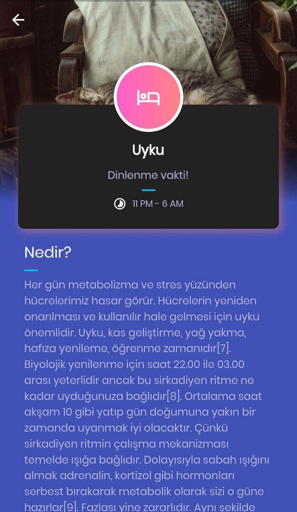

# bioclock

Bio'clock helps the user to adjust their daily routine according to own biological internal clock. This Flutter application represents the draft UI of the project.

  

  

### Resources
* Information page originated from [planet-flutter](https://github.com/sergiandreplace/planets-flutter).
